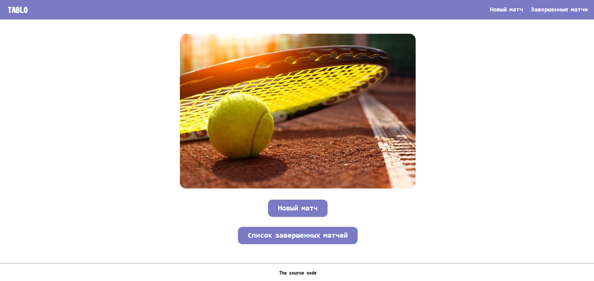
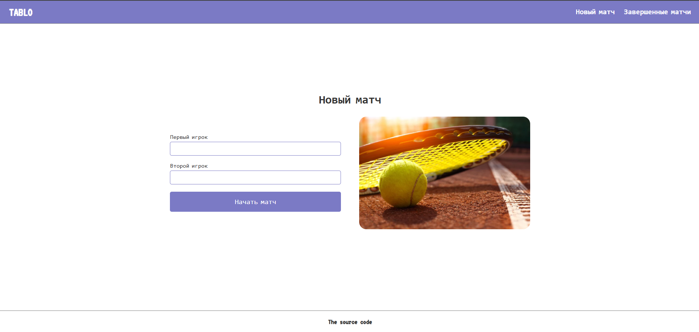
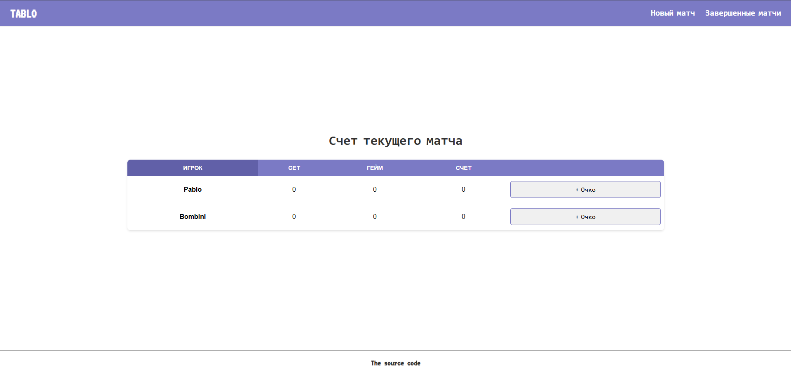
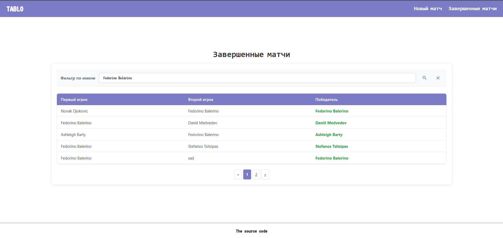

# 🎾 Tennis Scoreboard | Табло теннисного матча

Веб-приложение для учёта и отображения результатов теннисных матчей.
Позволяет создавать новые матчи, добавлять игроков, вести счёт и 
просматривать историю завершённых игр.

## Возможности

- Создание матча между двумя игроками.
- Ведение счёта матча и сохранение его в памяти приложения.
- Просмотр списка завершённых матчей с пагинацией и фильтрацией по имени игрока.

## Стек технологий

- Java 17
- Servlet API (Jakarta EE 6)
- H2 Database (in-memory)
- Hibernate ORM
- JUnit 5
- JSP, HTML, CSS
- Maven
- Tomcat 11

## Навигация

**Базовый адрес**: http://localhost:8080/ \
**Формат ответа**: HTML

### Главная

- **URL**: `/` 
- **Описание**: Главная страница, содержащая ссылки на основные эндпоинты приложения



### Новый матч

- **URL**: `/new-match`
- **Описание**: Страница для создания матча посредством заполнения формы с именами игроков



### Счет текущего матча

- **URL**: `/match-score?uuid=$uuid`
- **Описание**: Страница отображает текущий счет теннисного матча с обновлением после 
каждого розыгрыша очка.



### Завершенные матчи

- **URL**: `/matches?page=$page&filter_by_player_name=$filter_by_player_name`
- **Описание**: Страница отображает историю всех завершенных теннисных матчей с результатами, 
а также предлагает пагинацию и фильтрацию по имени игроков.



## Установка

### Требования

- Java 17+
- Tomcat 11

### Шаги установки

1. **Клонируйте репозиторий**

   ```bash
   git clone https://github.com/ferty460/tennis_scoreboard.git
   ```
   
2. **Соберите проект**

   ```bash
   mvnw clean package
   ```

    - После сборки в папке `target` появится файл `ROOT.war`
   
3. **Разместите приложение в Tomcat**

    - Скопируйте `ROOT.war` в папку `webapps` вашего Tomcat-сервера

4. Перезапустите Tomcat

    - После перезапуска приложение будет доступно по адресу `http://localhost:8080/`